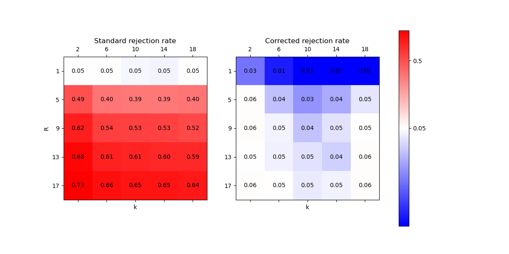

# subsampling_significance_tests

Statistical tests for comparing the performance of machine learning models using resampling methods, such as repeated cross-validation.

## Corrected repeated cross-validation t-test (Nadeau and Bengio, 2003)

https://scikit-learn.org/stable/auto_examples/model_selection/plot_grid_search_stats.html#comparing-two-models-frequentist-approach

Presents a method for variance correction in subsampling methods, such as repeated cross-validation.

The corrected variance is:

$(\frac{1}{n} + \frac{n_{\text{test}}}{n_{\text{train}}}) * \text{Var}(x)$

where n is the number of comparisons (e.g. k*r in repeated k-fold), n_test is the number of test samples, n_train is the number of training samples, and Var(x) is the standard variance of the performance measure.

Nadeau, C., Bengio, Y. Inference for the Generalization Error. Machine Learning 52, 239–281 (2003). https://doi.org/10.1023/A:1024068626366
https://scikit-learn.org/stable/auto_examples/model_selection/plot_grid_search_stats.html#comparing-two-models-frequentist-approach

The figure above shows rejection rates of the corrected repeated cross-validation t-test and a standard t-test on different k and r values of repeated k-fold cross-validation with alpha=0.05.
The corrected test's rejection rate is very close to alpha when R>1, while the standard t-test's rejection rate is much higher than alpha.
The corrected test is overly conservative when R=1 as expected.
There is no clear effect of k on the corrected test's rejection rate, while the standard t-test's rejection rate decreases with k.

## Evaluating the Replicability of Significance Tests for Comparing Learning Algorithms

This paper seems to just empirically evaluate the method in the paper by Nadeau and Bengio (2003), but is easier to understand. Includes:

- Tests based on random subsampling
- Tests based on repeated k-fold cross validation

Bouckaert, Remco R., and Eibe Frank. "Evaluating the replicability of significance tests for comparing learning algorithms." Pacific-Asia conference on knowledge discovery and data mining. Berlin, Heidelberg: Springer Berlin Heidelberg, 2004.
https://citeseerx.ist.psu.edu/document?repid=rep1&type=pdf&doi=1a5eda200e69fc88a3babea8835997f8846739e5
